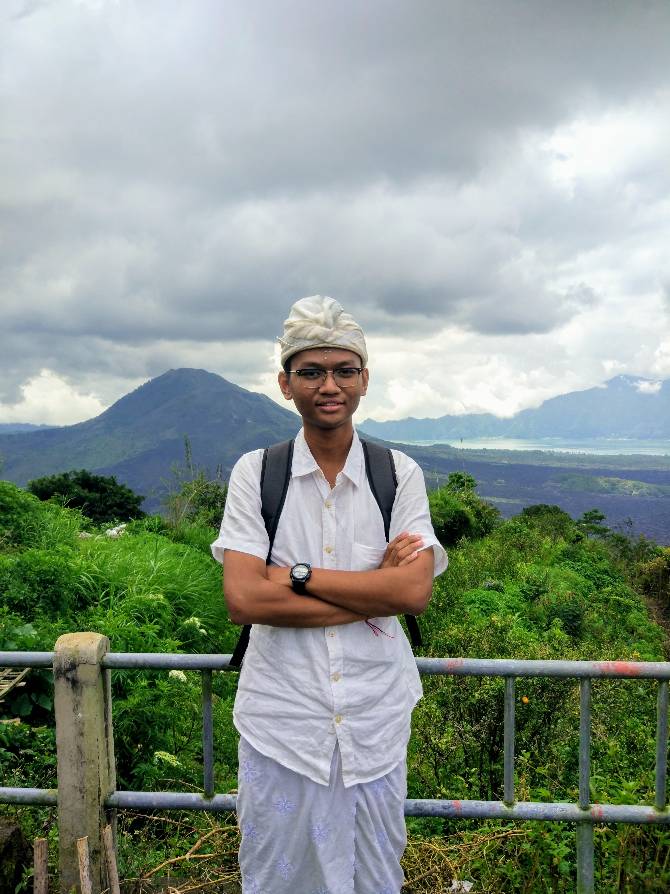

Eling di Bali circa 2018.

Halo semuanya! Halo teman-teman sekalian! Salam satu hati satu jiwa FILKOM!

Perkenalkan, saya R. Komang Eling Pramuatmaja (NIM 185150200111081) dari cluster 11, kelompok 43 PK2MABA & Startup Academy 2018. Saya dari Prodi Teknik Informatika, Fakultas Ilmu Komputer, Universitas Brawijaya. Saya berasal dari Denpasar, Bali, Indonesia.

Saya memilih Universitas Brawijaya karena _track record_-nya yang terpercaya dan sudah bertahun-tahun selalu berada dalam 14 besar peringkat Perguruan Tinggi Non-Vokasi Terbaik di Indonesia. Selain itu, prodi Teknik Informartika-nya juga terkenal akan kualitasnya di antara ratusan prodi serupa yang ada di perguruan tinggi lainnya. Saya memilih Teknik Informatika karena sejak kecil saya sangat tertarik dengan dunia komputer dan terpukau ketika mengetahui bahwa semua aplikasi dan “otak” dari komputer yang canggih itu diciptakan dengan _programming_, sesuatu yang saya ketahui pertama kali dari kakak saya dan _website_ [Code.org](https://www.code.org). Untuk memperdalam keingintahuan saya tersebut, sejak SMP, saya aktif mempelajari dasar-dasar dari _coding_ dari berbagai _website_. Setelah melewati berbagai macam kejenuhan dan perubahan fokus di masa SMP dan SMA, saya pun memilih untuk mendalami hal ini dengan cara mempelajarinya langsung di bangku kuliah. Saya berharap dengan kemampuan yang akan saya dapatkan di bangku kuliah nanti, saya dapat menciptakan suatu hal yang dapat membantu masyarakat sekitar maupun dunia. Mengingat dunia sedang menuju revolusi industri keempat yang sangat membutuhkan peran dari teknologi komputer, maka saya rasa keahlian _programming_ merupakan cara terbaik untuk dapat berkontribusi pada dunia. Selain itu, dengan berkuliah merantau di Universitas Brawijaya, saya juga dapat mengasah kemandirian dan disiplin saya dalam menghadapi kehidupan sehari-hari. Dengan _soft skill_ tersebut, tentu saya dapat menjadi pribadi yang sukses di masa depan. Itulah alasan saya memilih untuk berkuliah di sini.

Sekian dulu perkenalan singkat dari saya. Untuk selanjutnya, saya akan mem-_posting_ tugas Deep Talk yang berisi serangkaian rangkuman dari _sharing session_ bersama orang-orang spesial yang saya ajak berdialog. _Have a nice day!_

\#PK2MABAFILKOM2018 #TakeTheAction

---

_Originally posted on [WordPress](https://elingp.wordpress.com/2018/08/17/perkenalan/)._
