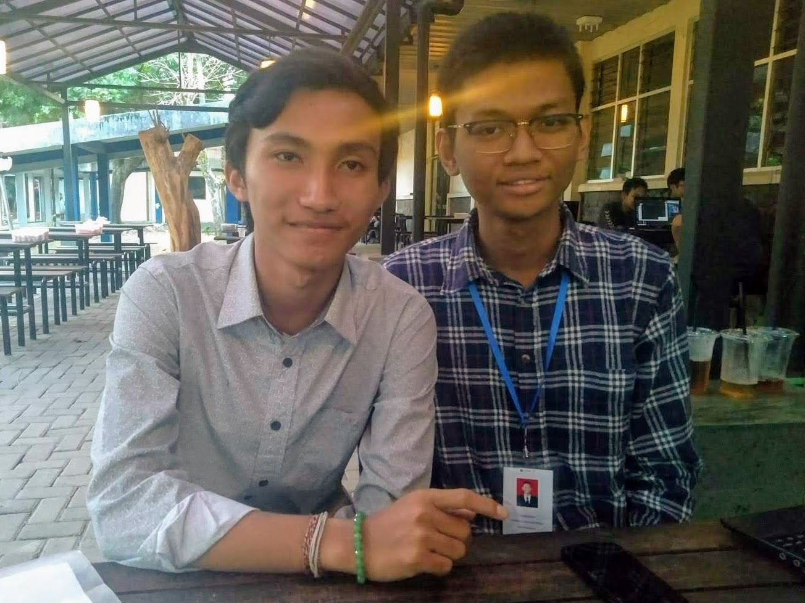

:::figure

Kak Candra dan Eling.
:::

Halo semuanya! Halo teman-teman sekalian! Salam satu hati satu jiwa FILKOM!

Pada kesempatan ini, saya berkesempatan untuk melakukan _sharing session_ dengan seorang kakak tingkat di Fakultas Ilmu Komputer yang bernama Kak Candra Sugiartha. Saat ini, Kak Candra mengenyam pendidikannya di prodi Pendidikan Teknologi Informasi dan termasuk dalam angkatan 2017. Kak Candra pada saat ini juga aktif dalam UKM Unikahidha yang menaungi mahasiswa UB yang beragama Hindu. Kak Candra ini berasal dari Denpasar, Bali dan merupakan alumni SMAN 3 Denpasar. Dalam _sharing session_ kali ini, kami berdua membicarakan berbagai hal, mulai dari sejarah awal Kak Candra memilih Universitas Brawijaya, pengalaman beradaptasi sebagai perantau, pengalaman selama setahun belajar, hingga tips-tips untuk mahasiswa baru seperti saya.

Berikut adalah rangkuman dari _sharing session_ yang saya lakukan bersama Kak Candra.

**Bagaimana sejarah Kak Candra masuk di UB?**

> Saya dulu masuk di sini (UB) melalui jalur SBMPTN. Milih di sini itu karena saya ingin merantau, tapi yang gak jauh banget. Nah, di Malang ini kan sehari bisa sampai di Bali, jadi deket. Trus, kakak milih PTI (Pendidikan Teknologi Informasi) itu karena memang passion di komputer, tapi gak suka yang begitu eksakta banget. Cocok deh sama PTI. Selain itu aku juga suka nge-_share_ ilmu, soalnya cara terbaik untuk belajar itu kan adalah dengan mengajar.

**Bagaimana pengalaman Kak Candra dalam beadaptasi di awal-awal masuk UB?**

> Dulu itu aku di tinggal di asrama, jadi sebenernya lebih gampang lah buat adaptasi karena gak jauh dari kampus. Trus, kalau urusan temen, karena aku itu dari luar (merantau), aku yang jadinya aktif nyari temen. Prinsipku itu gampang: kalau aku bisa buktiin kemampuanku, pasti aku yang dicari temen. Jadi ya aku aktif dalam semua kegiatan. Aku juga aktif ikut kepanitiaan buat nambah temen. Ya, kalau menurutku sih semester 1 itu sama aja kayak waktu SMA dulu, gak jauh beda.

**Bagaimana pengalaman Kak Candra selama setahun belajar?**

> Pengalaman yang paling unik itu sih saat ngoding. Soalnya aku gak pernah belajar sebelumnya, jadi ini pengalaman yang paling keren sekaligus seram dan menguras otak. Pokoknya banyak dah yang harus dipelajari kalau soal ngoding. Trus, kalau soal dosen, ada juga pengalaman yang unik. Dulu aku pernah dapet dosen profesor yang cukup tua. Dia itu suaranya kecil banget, jadi gak bisa didenger oleh seluruh kelas. Pas jamnya dia ini, biasanya mahasiswa pada tidur, tapi beliau tetep aja acuh. Beliau itu prinsipnya ya pokoknya udah ngajar aja udah cukup. Mau didenger atau enggak itu bebas. Trus ada juga nih dosen yang kalau telat satu menit aja, langsung disuruh nge-_resume_ satu buku menjadi empat halaman _double folio_. Bayangin aja, itu masuk jam 7 pagi dan gak boleh telat semenit pun. Ngeri dah pokoknya itu.

**Apakah Kak Candra ada tips buat para mahasiswa baru?**

> Jelas ada. Yang pertama itu soal ospek. Menurut kakak, ospek di Filkom itu udah paling bagus dan paling santai kalau dibandingkan dengan ospek-ospek fakultas lainnya. Jadi, jalanin aja dengan bener. Pokoknya ikutin aja arahan dan rangkaiannya karena semuanya itu bermaksud untuk mengenalkan kalian dengan kehidupan mahasiswa yang kalian akan jalani.
>
> Kedua, atur waktu kalian dengan baik. Selalu utamakan kuliah. Kerjakan tugas lebih awal atau bahkan langsung setelah kuliah kayak yang aku biasa lakukan. Soalnya, setelah kuliah itu ilmunya pasti masih nyangkut, jadi lebih gampang nyelesaiinnya. Setelah tugas selesai, baru lah lanjut ke organisasi dan kepanitiaan.
>
> Ketiga, benerin belajar kalian. Buat belajar supaya senyaman mungkin bagi kalian. Mau sambil main atau gimana, setiap orang pasti berbeda-beda caranya. Cari itu. Yang penting itu gimana caranya biar ilmunya dapet. Kalau aku sih biasanya dengan me-_review_ apa yang aku pelajari seusai kuliah. Kemudian untuk motivasi belajar, terutama buat matkul yang sulit, biasanya aku berkaca kepada kakak tingkat. Mereka aja mampu, masak kita gak bisa. Gampangnya gitu. Trus kalau bener-bener gak suka sama matkulnya, berusahalah untuk mencari manfaat dari matkul itu. Biar merasa berguna dan gak buang-buang waktu gitu. Pasti ada deh manfaatnya. Jalani aja pokoknya.
>
> Terakhir, kelima, hormati semua orang di sini. Baik itu dosen, staff, kakak tingkat, bahkan tukang bersih-bersih. Kita ini semua keluarga, jadi harus saling menghargai. Gak boleh namanya acuh dengan sesama.

**Untuk mengakhiri, Kak Candra ada ucapan penutup gak buat kami semua?**

> Oh, tentu ada. Kuliah gak seserem yang kalian bayangin. Sedikitpun usaha kalian sama dosen itu pasti dihargai kok. Dosen itu lebih dewasa pemikirannya. Selain itu, dosen-dosen di sini baik-baik kok, jadi tenang aja. Jalani aja semuanya.

Baik, cukup sekian rangkuman dari _sharing session_ saya dengan Kak Candra, mahasiswa PTI 2017. _Have a nice day!_

\#PK2MABAFILKOM2018 #TakeTheAction

---

_Originally posted on [WordPress](https://elingp.wordpress.com/2018/09/05/deep-talk-2/)._
