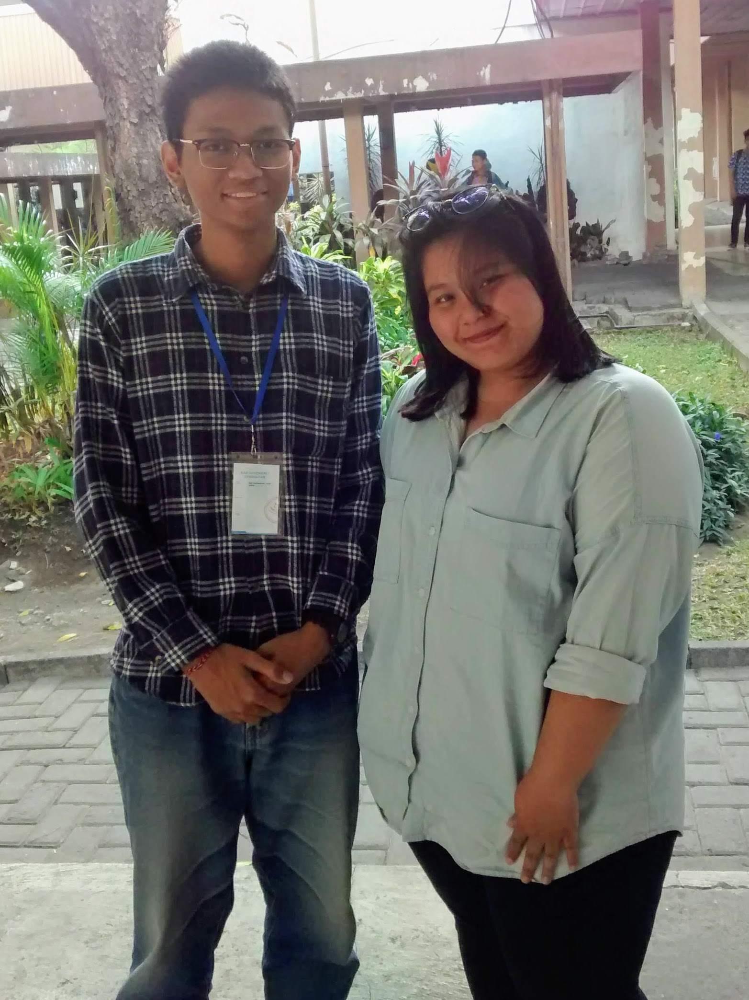

:::figure

Eling dan Kak Felin.
:::

Halo semuanya! Halo teman-teman sekalian! Salam satu hati satu jiwa FILKOM!

Kali ini saya melakukan _sharing session_ dengan panitia PK2MABA & Startup Academy 2018 yang bernama kak Felinda Gracia Lubis atau yang biasa dipanggil kak Felin. Saat ini kak Felin bertugas sebagai Kepala Divisi Kesehatan dalam kepanitiaan PK2MABA & Startup Academy 2018. Kak Felin sendiri adalah mahasiwa Teknik Informatika angkatan 2016 yang berasal dari Serang, Banten. Dalam _sharing session_ kali ini, kami berdua membicarakan berbagai hal, mulai dari sejarah masuk UB, pengalaman saat kuliah dan kepanitiaan, alur suatu kepanitiaan terbentuk, pengalaman KRS-an, hingga tips supaya motor gak dicuri dan cara manajemen waktu.

Berikut adalah rangkuman dari _sharing session_ yang saya lakukan bersama Kak Felin.

**Kenapa kak Felin memilih untuk masuk UB?**

> Sebenarnya gak pernah ada pikiran untuk masuk UB sih. Dulu waktu SMA mikirnya itu masuk ITS atau UI. Waktu SNMPTN, aku ngambil Fasilkom UI, tapi gak masuk. Lewat Simak UI juga gak masuk. Trus waktu SBMPTN, aku milih untuk gak ambil UI dan pilihan pertama itu jadinya ITS, kedua UB, trus ketiga UGM rumpun Soshum. Jadi ikut IPC gitu, karena sebenernya aku lebih suka ke hukum gitu. Dulu waktu SMA memang jurusannya IPA, tapi iseng mau nyoba FH UGM. Eh trus dapetnya di sini, di Universitas Brawijaya. Pertama agak kecewa sih, tapi lama-lama aku syukuri aja; mungkin memang jodohnya di sini. Kalau soal ngulang, aku emang gak kepikiran karena waktu 2016 itu aja yang masih fresh ingatannya gak bisa, apa lagi tahun 2017 ngulang. Pasti nanti bakal lebih gak siap lagi karena udah lupa. Mending dijalani aja di sini biar fokus. Lama-lama pasti nyaman kok.

**Bagaimana pengalaman pertama kak Felin merantau dan menjadi mahasiwa baru?**

> Aku sebenernya sengaja milih di Jawa Timur karena ada keluarga di sini. Tapi di Malang sendiri sebenernya gak ada keluarga. Selain itu, aku memang dari SMA udah sering ditinggal sendiri gitu, jadi ya udah biasa mandiri. Gak sulit kok merantau, tapi malah lebih seneng karena merasa bebas gitu. Cuma gak enaknya itu kalau lagi sakit gitu karena gak ada yang ngerawat. Trus buat di Malang sendiri, beda jauh dengan di Banten. Yang paling kerasa itu sih dari bahasanya. Walaupun banyak yang merantau, tetep aja lebih banyak yang dari Jawa Timur, jadi banyak yang pakai bahasa Jawa. Kalau di Banten dulu kan soalnya kebanyakan pakai bahasa Indonesia. Itu yang paling terasa waktu pertama kali di Malang. Trus di sini itu lebih dingin dibandingkan di Serang, soalnya di Serang itu kan kota industri, sedangkan kalau di sini itu lebih hijau. Trus kalau masalah bahasa tadi, bahasa Jawa, sekarang itu aku udah lumayan bisa, tapi pasif, jadi ngerti maksudnya apa tapi gak bisa ngomongnya. Untungnya temen-temenku kebanyakan dari luar Jawa Timur semua, jadi kita ngobrolnya lebih sering pakai bahasa Indonesia.
>
> Kalau pengalaman sebagai mahasiswa baru, mungkin mengenai pengalamanku dapetin temen baru. Dulu, dari grup angkatan itu aku ketemu banyak temen baru, dan beberapa sering aku ajak chat. Kebetulan ada yang dari Banten dan _se-cluster_ sama aku juga. Mereka-meraka inilah, temen-temen semester satu, yang bakalan jadi temenmu selamanya gitu. Biasanya aku KRS-an sama temen-temen itu lagi. Walaupun dapet kelas beda, setelah kelas pasti kami tetep ngumpul lagi kok. Aku juga ada tips buat maba nih. Pokoknya jangan sampai ngulang ospek. Gak enak gitu harus pemutihan atau ngulang. Hari Sabtu nya jadi gak tenang. Pokoknya ikutin aja rangkaiannya. Nikmati sebagai mahasiswa baru. Nanti pas semester tua gak bakal bisa leha-leha, pasti sibuk dengan proyek dan laporan praktikum.

**Bagaimana pengalaman kak Felin selama kuliah?**

> Soal kuliah, mungkin bisa mengenai dosen sama mata kuliahnya. Kalau dosen, aku untungnya dapet yang baik-baik aja sih. Kalau kuliah kan memang kita harus belajar sendiri gitu. Dosen gak bakal ngajar semuanya dari a sampai z, jadi kita harus proaktif. Dosen pasti objektif kok, jadi ya tenang aja. Kalau soal mata kuliah, jujur aja menurutku ngoding itu masih agak sulit. Java itu aku masih agak kurang ngerti. Semester satu dua kan masih Java aja nih. Nanti semester tiga bakalan mulai macem-macem bahasanya. Makin pusing dah pokoknya. Tapi ya, jalanin aja. Sedikit tips buat ngoding sih ya sering-seringin praktiknya dan jangan berpaku hanya pada teori aja.

**Bagaimana pengalaman kakak ikut organisasi atau lembaga?**

> Kalau aku sebenarnya gak terikat sama organisasi apapun. Aku ikutnya kepanitiaan aja. Aku gak suka terlalu dikekang gitu sama organisasi. Kalau ikut organisasi kan biasanya ada batas maksimal ikut proker tuh, sedangkan kalau kayak aku kan bebas, bisa ikut kepanitiaan dari proker apa aja. Ikut kepanitiaan itu gak harus berasal dari BEM gitu kok. Pokoknya nanti bakalan ada _open recruitment_ gitu buat nyari anggota kepanitiaan. Kepanitiaan itu sendiri awalnya dimulai dengan nentuin ketua pelaksana. Itu nanti para calonnya di-_screening_ sama organisasi yang menaungi acaranya kayak BEM atau HM gitu. Nanti setelah itu kapel (ketua pelaksana)-nya yang punya hak buat nentuin BPH (Badan Pengurus Harian) seperti kepala divisi dan lain sebagainya. Kalau staff baru ada open recruitment-nya. Nanti bakalan ada daftar _online_, trus _offline_, trus baru _screening_. _Screening_ itu nanti ditanya-tanyain kayak wawancara. Nanti bakal dikasi pertanyaan yang umum dan pertanyaan yang spesifik berhubungan dengan divisi yang diinginkan.

**Sebagai penutup, kak Felin ada tips atau pesan gak buat mahasiswa baru?**

> Kalau tips mungkin soal manajemen waktu. Semuanya akan terstruktur dengan sendirinya kok. Tapi inget aja, prioritas utama kita di sini itu kan untuk kuliah, jadi kalau ada apa-apa gitu, selalu utamakan kuliah. Tapi selama pengalamanku, aku gak pernah ada masalah kok. Filkom itu soalnya enak, gak ada kuliah malam, jadi semuanya udah selesai sore hari. Urusan kepanitiaan itu jadinya bisa dilakuin setelah selesai kuliah. Pokoknya jangan sampai sibuk kepanitiaan tapi kuliah gak jalan.
>
> Kemudian soal pesan, buat yang merasa salah jurusan, gak apa kok. Ulang SBMPTN juga gak apa. Kejar mimpi kamu. Tapi, kalau kamu gak mau dan gak ada usaha untuk ngulang lagi, ya udah syukurin aja dapet di sini. Kamu gak bakal diterima di sini kalau jalanmu gak di sini. Kamu diterima di sini pasti karena suatu alasan.

Baik, cukup sekian rangkuman dari _sharing session_ saya dengan kak Felin, ketua divisi Kesehatan PK2MABA & Startup Academy 2018. _Have a nice day!_

\#PK2MABAFILKOM2018 #TakeTheAction

---

_Originally posted on [WordPress](https://elingp.wordpress.com/2018/10/01/deep-talk-3/)._
