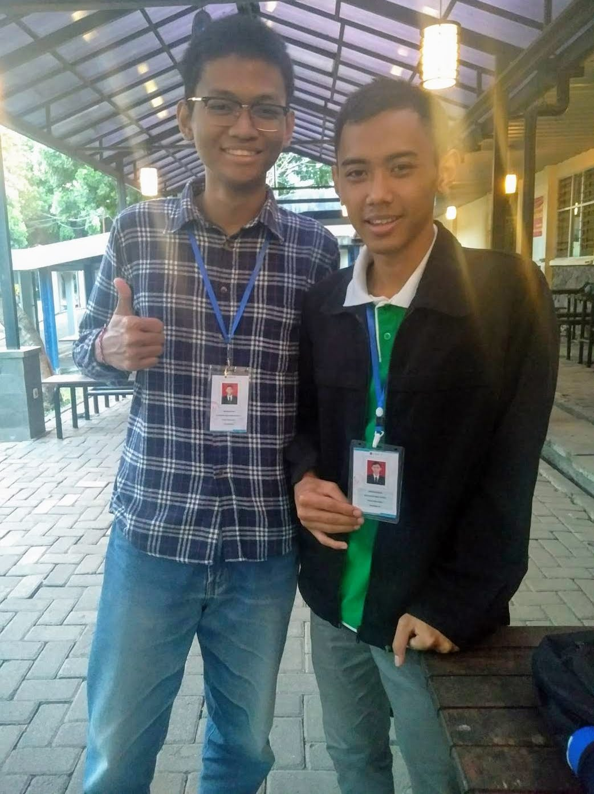

:::figure

Eling dan Rama.
:::

Halo semuanya! Halo teman-teman sekalian! Salam satu hati satu jiwa FILKOM!

Kali ini saya berkesempatan untuk melakukan _sharing session_ dengan teman satu prodi saya yang kebetulan satu asrama juga, Putu Rama Bena Putra. Saat ini, Rama mengenyam pendidikannya di prodi Teknik Informatika angkatan 2018. Rama berasal dari Bali dan dulu bersekolah di SMAN 1 Kuta Selatan. Dalam _sharing session_ kali ini, kami berdua membicarakan berbagai hal, mulai dari alasan memilih Teknik Informatika UB, pengalaman selama kuliah dan merantau, dan harapan dari belajar mengenai Teknik Informatika.

Berikut adalah biodata singkat Rama yang saya ambil dari [WordPress-nya](https://ramabenarb.wordpress.com/2018/08/18/about-me/).

> Di Malang ini saya harus berpisah dengan keluarga demi mencari ilmu, bukan suatu hal yang mudah tetapi mesti dilakukan. Saya adalah tipe orang yang menyukai berpikir dibanding menghapal, dan matematika adalah pelajaran favorit saya di sekolah dari SD sampai SMA karena mudah dan sedikit menghapal. Lalu saya tertarik dengan dunia Informatika yang berawal dari OSN Informatika. Yang awalnya dari tingkat kabupaten mengerjakan matematika diskret sampai dengan tahap nasional mengerjakan permasalahan dengan program, dan syukur saya mendapat medali perunggu di OSN Informatika tahun 2016 dan di tahun 2017. Untuk itu saya sudah merencanakan untuk memilih program studi Teknik Informatika/Ilmu Komputer, dan FILKOM adalah tempat saya akan mengasah ilmu informatika saya.
>
> Untuk di Teknik Informatika sendiri saya sudah memiliki sedikit basic, untuk urusan ngoding sendiri saya menguasai bahasa pemrograman C++ hanya sampai OOP dan belum pernah buat project besar, untuk Java sendiri saya baru pertama kali tapi sangat mirip C++. Tapi saya rasa cukup untuk mengikuti prodi Teknik Informatika, sehingga saya berharap bahwa saya tidak salah prodi 🙂

Nah, setelah mengenal Rama melalui biodatanya sendiri, mari kita telusuri lebih dalam melalui Deep Talk saya dengan Rama. Berikut adalah rangkuman dari _sharing session_ yang saya lakukan bersama Rama.

**Kenapa kamu milih UB?**

> Karena UB dekat dan ada di luar Bali. Aku soalnya mau merantau gitu. Selain itu, UB itu juga bagus dan banyak kakak kelas SMA dulu di sini.

**Kenapa tertarik sama Teknik Informatika?**

> Karena udah bisa ngoding dari peralihan SMP ke SMA. Jadi setelah selesai UN SMP itu aku belajar bahasa Pascal, trus setelah sebulan belajar Pascal, aku ikut OSN (Olimpiade Sains Nasional) Informatika, dan pas OSN 2016 itu aku satu-satunya finalis nasional yang pakai Pascal. Trus setelah aku lihat kalau ternyata bahasa C++ lebih gampang, aku coba pakai C++ buat ikut OSN, tapi sayangnya tetap dapat perunggu aja di OSN 2017. Jadi intinya milih TIF itu karena ingin memperdalam pengetahuan mengenai TIF gitu.

**Gimana pengalaman selama kuliah di UB?**

> Seru kok. Paling seneng pas ospek, terutama ospek yang fakultas. Paling seru pokoknya kalau dibandingkan dengan ospek universitas sama prodi. Untuk perkuliahan juga menurutku masih lumayan gampang karena aku udah punya basic gitu. Sudah bisa sampai semester 3 atau 4 lah kalau untuk yang pemrograman aja. Jadi ya masih gampang sih, soalnya udah bisa aja.

**Gimana pengalamanmu merantau?**

> Ini bukan yang pertama kali sih. Sehabis OSN itu soalnya dulu ada ada pelatnas (pemusatan latiha nasional) gitu selama sebulan buat persiapan lomba tingkat internasional. Waktu 2016 dulu aku sebulan di Bandung, jadi udah pernah rantau di sana. Trus kalau 2017 di Bogor. Tapi kalau rantau yang sekarang, di Malang, mungkin bedanya ya karena gak tau tempat, jadi harus cepat beradaptasi. Selain itu sih gampang aja, gak ada masalah. Mungkin kesusahannya itu karena belum ada kendaraan sama helm gitu, jadi gak bisa kemana-mana.

**Apa harapanmu dari belajar TIF?**

> Sebenernya cita-citaku itu jadi _programmer_, tapi karena banyak cabangnya, jadi mungkin aku ikutin dulu alurnya. Kalau soal keminatan sih aku memang tertariknya sama Komputasi Cerdas. Kalau kerjanya di mana, aku belum ada bayangan sih mau di mana, tapi target mungkin di luar negeri karena di dalam negeri itu belum begitu banyak pekerjaannya.

Baik, cukup sekian rangkuman dari _sharing session_ saya dengan Rama, teman dari prodi Teknik Informatika. _Have a nice day!_

\#PK2MABAFILKOM2018 #TakeTheAction

---

_Originally posted on [WordPress](https://elingp.wordpress.com/2018/10/03/deep-talk-5/)._
