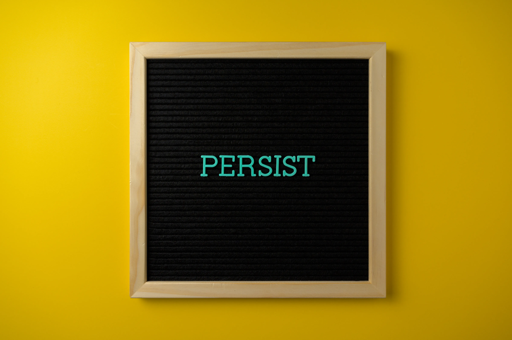

<i><small>Persistence is an important mindset.</small></i>

Persistence is a recurring theme in many fictional stories. The hero will face struggles along the way, tasting failure upon failure but never giving up, until they succeed in being the hero of the story. They fight with their circumstances until success is the only option. It is a cliché in narration you can find anywhere, from movies, novels, and comic books; from the western to the eastern culture. It is a cliché we also need in real life.

Simply, being persistent is the key mindset to achieving your goal. I, too, believe in this mindset. I have my fair share of failure, not from defeating the demon king or the supervillain, but from my goals and hope in life. The time seemed to stop when I failed, agonizing over the things I should have done until eventually accepting my failure–[the five stages of grief](https://en.wikipedia.org/wiki/Five_stages_of_grief). Lucky me, I got the help of someone to realize the wisdom to tackle this quite early.

It was my father who taught me about persistence. One day when I was crying upon a certain failure, my father said a simple phrase, “The show must go on.” It has stuck in my head ever since. He did not explain much about the meaning of it, but I reflected and realized that this is his way of teaching me about persistence–whatever happens in our lives, the _show_ must still go on. Even if we need to put on a mask, even if it hurts, the time will still be ticking and the act will continue. We should not be frozen in time by mishaps because life won’t wait for us.

It sounds a bit grim alright, but do not take it the wrong way. It is the mindset of being a realist–realizing that staying still will not get you anywhere in life. It is most definitely okay to take a break when you just gaze at the face of failure. Take a moment to reflect, plan on future improvements, and then continue living. That is the sequence of action for me, at least. The key is to not stay motionless for longer than you need.

As an analogy, I dwelled in quite a dark place after I failed a certain top university entrance exam a few years back. I felt sickened, loathing myself all the time, and froze in time. Since I did not have any classes or activities after that announcement, I passed my days without doing anything. I have no fond memories of that time. I eventually managed to bounce back after some downtime and acknowledge that the past is in the past and I need to plan for the future. I cannot change what has been done–it is the [dichotomy of control](https://traditionalstoicism.com/dichotomy-of-control/) in action. This sequence of events is, in a way, the actualization of “the show must go on” for me. I dearly remember this afterthought about the phrase at the time and still do ever since.

Writing this piece reminds me of a novel called [_Three Days of Happiness_](https://en.wikipedia.org/wiki/Three_Days_of_Happiness). The story revolves around the idea that you can exchange your future life for monetary value. The main character, being the failure he is, sells years of his life, leaving 3 months left, to get 10,000 yen per year–his value is that low. There is a catch to calculating one’s life value though, it fluctuates depending on your circumstances–whether you are contributing to society, whether you are happy, whether you are
making others happy, among others. The story continues with him spending the rest of his time with a girl who is tasked to observe and prevent him from making trouble since people tend to do so with less than a year to live. In the days to come, he spent it vividly full of happiness, cleared up past grudges, and learned about love. With one month left, he decided to sell the rest of his lifespan leaving only three days left. Turns out, his monetary value increases tenfold in just that small window of time–his one month left is priced higher than the years he had sold before. The rest of the three days are left for the reader to imagine, and I would like to think that these three days will be valued even more than the one month because he is blossoming with even more happiness.

How can this story correlate with either being persistent or the quote? It is in the way of calculating one’s life value. The story explained that it fluctuates based on the future that might happen according to your past and current self. The main character was frozen in time and realized too late when he already made the deal to sell his life. It is the simple act of taking control of your life and changing the future that might happen, thus increasing your value. To put into perspective, you can reach a certain future (called point D) if you have passed point A in the past and currently is in point B. But, say, you did not move into point C and branch out into a different path altogether like point Φ. Your future will change and not reach point D again (as in A-B-C-D). This is the main idea; of taking control and going in with the show, even if you have walked through a certain pathway before.

Okay, I might be overstretching a bit, but I am just in love with that particular novel right now. If there is any point to take from this article, it is to keep going with your life even if you are facing hardship. Let Eren Yeager shout “[_tatakae_](https://skdesu.com/en/what-means-tatakae-and-tatakai/)” to you and improve the value of your life. The show must go on.

---

_This writing is a series of assignments for my program at Generasi GIGIH 2.0 held by Yayasan Anak Bangsa Bisa. Expect more writing to come!_

_Originally posted on [Medium](https://elingp.medium.com/being-persistent-5fb5b045788b)._
