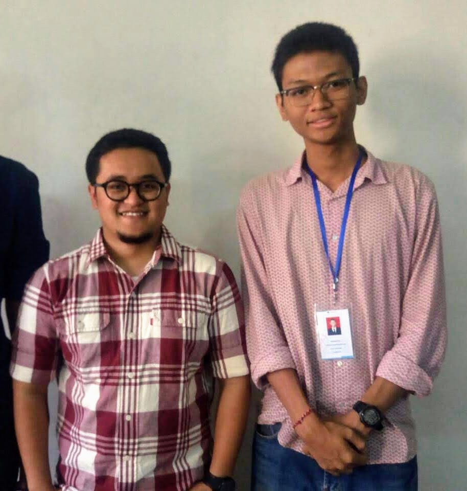

:::figure

Pak Lana dan Eling.
:::

Halo semuanya! Halo teman-teman sekalian! Salam satu hati satu jiwa FILKOM!

Kali ini saya berkesempatan untuk melakukan _sharing session_ dengan seorang dosen di Fakultas Ilmu Komputer yang bernama pak Rizal Maulana atau yang biasa dipanggil Pak Lana. Saat ini beliau bertugas untuk mengajar mata kuliah Sistem Digital, Rekayasa Perangkat Lunak, Sistem Medis Berbasis Komputer, dan Robotika. Beliau juga merupakan pembimbing klub Robotika di Fakultas Ilmu Komputer. Beberapa bulan yang lalu, beliau mendapatkan penghargaan _best presenter_ dalam konferensi di Moskow dan beberapa hari yang lalu beliau juga melakukan presentasi di Jepang. Beliau ini adalah lulusan S2 di Taiwan dan S1 di Universitas Brawijaya. Dalam _sharing session_ kali ini, kami berdua membicarakan berbagai hal, mulai dari sejarah beliau menjadi dosen, pengalaman selama menjadi dosen, tips-tips untuk mendapatkan beasiswa, hingga harapan buat mahasiswa baru Filkom 2018.

Berikut adalah rangkuman dari _sharing session_ yang saya lakukan bersama Pak Lana.

**Bagaimana sejarah Pak Lana hingga menjadi dosen?**

> Saya mulai mengajar di Filkom sejak tahun 2014 dengan fokus pada prodi Teknik Komputer. Saya sudah bercita-cita untuk menjadi dosen sejak saya menjadi asisten lab Sistem Digital. Waktu saya ngajar dulu, saya ngerasa enak aja _sharing_ ilmu dengan orang lain. Akhirnya keterusan deh saya jadi dosen. Kemudian, perjalanan saya untuk menjadi dosen itu cukup panjang. Minimal untuk jadi dosen itu kan S2, nah saya itu lulus S1 di Universitas Brawijaya pada tahun 2011. Trus, saya nyari-nyari beasiswa untuk melanjutkan studi dan baru dapat tahun 2012. Waktu itu beasiswa kuliah S2 _double degree di_ UB dan di Taiwan. Setelah lulus, saya langsung ngelamar di UB dan diterima di prodi Teknik Komputer. Saya memilih Teknik Komputer itu karena saya menyukai _programming_ dan robotika, dan dalam Teknik Komputer itu 60% _hardware_ dan 40% _software_, jadi masih masuk dalam keahlian saya.

**Bagaimana pengalaman Pak Lana selama menjadi dosen di sini?**

> Di sini ada banyak suka dukanya. Sukanya itu saya bisa ketemu mahasiswa tiap tahunnya dan ganti-ganti orangnya. Jadi, saya masih merasa sedikit muda. Hehe. Kemudian dukanya itu ketika mahasiswa yang saya ajar ada yang tidak lolos mata kuliah. Kasian aja saya.

**Bagaimana karakteristik mahasiswa dan dosen di Filkom menurut Pak Lana?**

> Kalau menurut saya pribadi, saya rasa semakin ke sini, etika mahasiswa itu makin menurun. Saya seneng kok bisa deket dengan mahasiswa, tapi jangan lupa kalau masih ada batasan antara dosen dan mahasiswa. Jadi etika harus tetap dijaga. Kalau karakteristik dosen, menurut saya dosen Filkom itu enak-enak kok. Bisa diajak _sharing_ dan santai semuanya, asal punya etika.

**Bagaimana pengalaman Pak Lana kuliah di Taiwan dulu?**

> Kalau menurut saya sih lebih berat dibandingkan dengan yang di sini. Soalnya kita itu harus tahu bahasa dan kebudayaan negaranya juga. Kendalanya itu di sana gak seluruh dosen bisa berbahasa Inggris, jadi terkadang harus ambil matkul yang bahasa pengantarnya itu bahasa Mandarin. Tapi kalau ada motivasi buat lulus, semuanya pasti gampang kok. Saya aja bisa.

**Apakah Pak Lana ada tips untuk mendapatkan beasiswa?**

> Kalau dari saya, IP nya harus tinggi. minimal 3,5 lah. Kemudian, skor TOEFL juga minimal 500. Kalian juga harus mencari minat kalian selama S1. Setelah itu cari penelitian atau referensi yang berhubungan dengan keminatan itu. Nanti kalian buat riset proposal tentang penelitian itu, mengenai apa yang mau dikembangin atau dilanjutkan dari penelitian itu. Itu sih untuk beasiswanya.

**Apakah Pak Lana ada tips untuk mahasiswa baru?**

> Kalau saran dari saya, kalian itu harus jaga kekompakan dengan temen-temen. Jadi harus kompak buat belajar bareng dengan temen. Ini sangat membantu sekali buat di semester awal seperti kalian. Selain itu, kuliah itu gak cuma nilai. Kalian harus seimbang dengan perkuliahan dan organisasi. Kalau ada kegiatan, ikuti saja agar ada nilai lebih nantinya.

**Sebagai penutup, apa harapan Pak Lana buat mahasiswa Filkom?**

> Maunya saya itu, mahasiswa Filkom yang lulus nanti itu gak ngelamar pekerjaan tapi membuat lapangan pekerjaan. Jadi langsung berguna bagi bangsa dan negara.

Baik, cukup sekian rangkuman dari _sharing session_ saya dengan Pak Lana, dosen Fakultas Ilmu Komputer. _Have a nice day!_

\#PK2MABAFILKOM2018 #TakeTheAction

---

_Originally posted on [WordPress](https://elingp.wordpress.com/2018/09/05/deep-talk-1/)._
