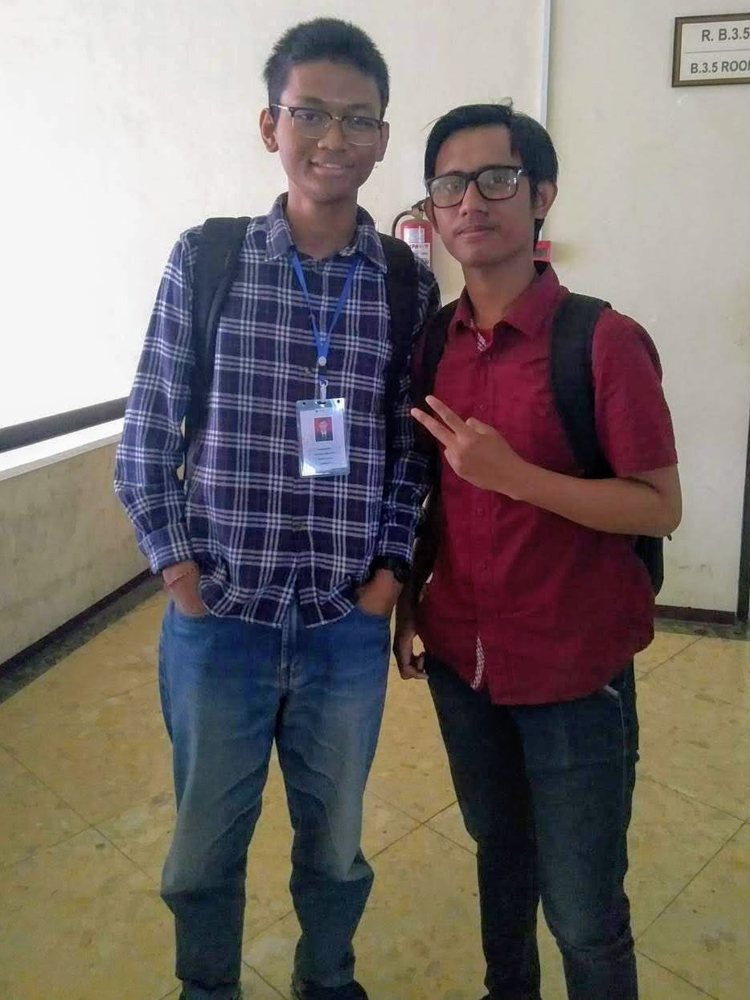

Eling dan Kak Yoga.

Halo semuanya! Halo teman-teman sekalian! Salam satu hati satu jiwa FILKOM!

Kali ini saya melakukan _sharing session_ dengan anggota HMIF (Himpunan Mahasiswa Informatika) yang bernama kak Yoga Darma atau yang biasa dipanggil kak Yoga. Saat ini kak Yoga bertugas di divisi PIP HMIF, menjadi anggota UKM Unikahidha, mengikuti kepanitiaan Bulan Ulang Tahun (BUT) Unikahida 2018, kepanitiaan Studi Ekskursi Informatika (SEIF), dan aktif di KMHDI Malang. Kak Yoga sendiri adalah mahasiswa Teknik Informatika angkatan tahun 2017 yang berasal dari Denpasar, Bali. Dalam _sharing session_ kali ini, kami berdua membicarakan berbagai hal, mulai dari sejarah memilih UB, pengalaman merantau dan menjadi mahasiswa, mengikuti kelembagaan, dan tips buat mahasiswa baru.

Berikut adalah rangkuman dari _sharing session_ yang saya lakukan bersama Kak Yoga.

**Kenapa kak Yoga memilih kuliah di UB?**

> Aku milih di UB itu karena sebenernya aku males SBMPTN. Aku masuk di sini itu lewat SNMPTN. Jadi aku itu dulu memang udah tau soal SNMPTN, jadi aku giatin belajar waktu sekolah di SMAN 5 Denpasar dulu. Aku juga tahu kalau banyak kakak tingkatku yang di UB, jadi kan kemungkinannya lebih tinggi. Makanya pas SNMPTN aku langsung nembak di UB dan dapet. Tapi kalau ditanya keinginan sebenarnya sih mau di ITB. Cuma pesimis aja ikut SBMPTN buat nyari ITB, soalnya sehabis UN itu aku gak belajar, jadi gak mungkin kan bisa lolos.

**Bagaimana pengalaman kak Yoga merantau di Malang?**

> Di sini itu aku gak ada kenalan keluarga, tapi ada banyak temen. Dulu aku satu kostan sama kating (kakak tingkat) dari SMA-ku. Ya, gampang sih jadinya karena udah ada kenalan. Tapi tetep bakal ada masa-masanya _home sick_, sampai nangis-nangis gitu di kamar. Aku pernah kayak gitu waktu masa-masanya Raja Brawijaya. Kangen orang tua soalnya. Tapi karena ada temen-temen kostan jadi lumayan tertutupi lah kangennya.

**Bagaimana pengalaman kak Yoga waktu awal-awal menjadi mahasiswa?**

> Yang paling terasa mungkin dari sisi tugas. Dulu waktu SMA aku jarang buat tugas di rumah. Kalau sekarang beda 180 derajat, semuanya harus dikerjain dari jauh hari. Sedangkan kalau dari jam pelajarannya itu sih lebih enak waktu kuliah, soalnya jamnya itu lebih fleksibel dan ada waktu telatnya. Kalau SMA kan gak bisa telat–lewat 5 menit aja udah gak dikasi masuk kelas. Ya, intinya sih semuanya di awal-awal pasti bakal sulit karena manajemen waktunya memang harus terlatih.

**Apa aja pengalaman kakak di organisasi?**

> Untuk di Filkom, aku ikut Himpunan Mahasiswa Informatika (HMIF) aja, tapi kalau di luar aku juga ikut UKM Unikahidha, trus jadi panitia di acara Bulan Ulang Tahun (BUT) Unikahidha dan Studi Ekskursi Informatika (SEIF). Aku juga aktif di KMHDI Malang.

**Bagaimana caranya masuk HMIF?**

> Sama kayak biasanya. Cuma bedanya nanti ada wawancara atau Focus Group Discussion (FGD) gitu. Bedanya sama diskusi biasa itu kan kalau FGD itu kita dituntut buat aktif berpendapat. Nanti bisa dilihat bagaimana prospekmu dan caramu mengungkapkan pendapat. Setelah itu baru dah pengumuman. Kalau lolos, nanti bakal ada diklat lagi. Banyak yang diterima kok di sini.

**Apa aja keseharian kak Yoga di HMIF? Apakah sering rapat?**

> Di HMIF itu kakak masuk divisi Pengembangan Ilmu dan Profesi (PIP). Nanti tugasnya itu mirip kayak PSDM (Pengembangan Sumber Daya Manusia), tapi lebih ke mengembangkan pengetahuannya. Jadi kayak skill, dengan ngadain workshop, trus ngasi informasi lomba dari universitas lain atau luar negeri. Ada juga info lowongan pekerjaan. Divisiku juga ada program kerja AyoDev yang ngajarin skill coding sama Study Club buat persiapan UTS sama UAS gitu.
>
> Untuk soal rapat, rapat divisi sih terserah departemennya. Kalau aku sih gak begitu sering. Lebih sering buat ngumpul di Sekretariat-nya aja. Rapat diadainnya kalau perlu aja. Trus kalau rapat besar juga gak terlalu sering. Yang penting itu kamu gak ada masalah pas di departemen nanti, pasti jarang rapat.

**Sebagai penutup, kak Yoga ada tips gak buat mahasiswa baru?**

> Kalau masalah organisasi, kalau bisa ikut organisasi, soalnya relasimu bakal jadi banyak. Kalau untuk kuliah, harus bisa manajemen waktu yang baik. Buat tugas jangan deket deadline. Semakin tua semesternya semakin ribet soalnya. Yang penting itu pokoknya manajemen waktu yang baik dan relasi yang banyak. Organisasi itu soalnya penting juga karena diperlukan saat pekerjaan nanti. Ada perusahaan yang bakal nanyain soal keaktifan kamu dalam organisasi untuk mengetahui apakah kamu bisa kerjasama tim. Kalau ikut organsiasi kan terbiasa nanti.

Baik, cukup sekian rangkuman dari _sharing session_ saya dengan kak Yoga, anggota HMIF dari divisi PIP. _Have a nice day!_

\#PK2MABAFILKOM2018 #TakeTheAction

---

_Originally posted on [WordPress](https://elingp.wordpress.com/2018/10/02/deep-talk-4/)._
