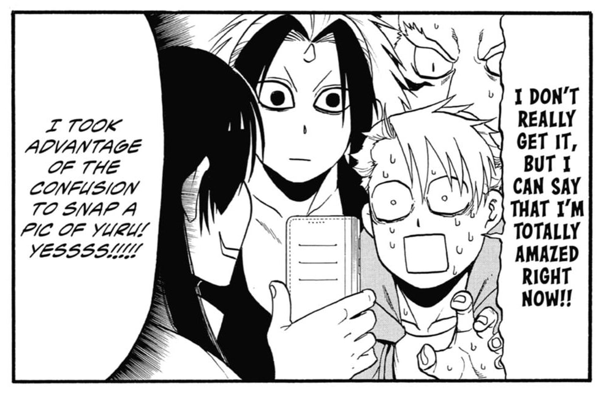

Hey there! Welcome to the first-ever post on my new blog, where I’ll be chatting about manga. I’m pretty new at this, so bear with me. I’m here to share some cool insights and keep the spoilers to a (hopefully) minimum.

## Introduction

Vol. 1 Cover

So, I’ve been hopping around different manga and manhwa, mostly the ones that pop up in Weekly Shonen Jump or Jump+. But then, MyAnimeList threw down the gauntlet with their annual “[You Should Read This Manga 2024](https://myanimelist.net/stacks/41944)” challenge. I’m all in for that sweet MAL badge I missed last year.

There’s this one manga that kept popping up everywhere: [_Daemons of the Shadow Realm_ (or _Yomi no Tsugai_)](https://myanimelist.net/manga/141772/Yomi_no_Tsugai). It’s like I couldn’t [escape it](https://en.wikipedia.org/wiki/Frequency_illusion), and for good reason. It’s snagged [some awards](https://en.wikipedia.org/wiki/Daemons_of_the_Shadow_Realm#Reception) and comes from the brilliant mind of Hiromu Arakawa—yeah, the genius behind [_Fullmetal Alchemist_](https://en.wikipedia.org/wiki/Fullmetal_Alchemist). So, I _just_ had to check it out.

I got my hands on all the English volumes ([via Square Enix](https://squareenixmangaandbooks.square-enix-games.com/en-us/series/daemons-of-the-shadow-realm)) and chapters ([on Manga UP!](https://global.manga-up.com/manga/168)) and binged them in just two days. Right now, there are 29 chapters, and things are getting really intense. Let’s jump into the details!

## Plot Summary

> In an isolated village, two twins were born, separated by day and night. It is years later, and while the older brother Yuru has become a hunter of animals, his sister Asa has been locked away in a cage, ordered to perform a special duty that prohibits her from meeting more than a few select individuals.
>
> On an otherwise inconspicuous day, a group of armed men riding in helicopters, referred to as “dragons” by the citizens, assaults the village in search of Yuru, killing everyone else on sight. When Yuru attempts to meet up with Asa and flee, he finds a dead body instead—on top of that, the person who killed her claims to be Yuru’s true twin sister.
>
> Before the woman can capture him, Yuru is rescued by a man named Dera, an outsider who frequently visits the village. However, it is not long before the two are cornered. In a last-ditch effort, Dera makes Yuru give a gift to the deity of the village, summoning a pair of “_tsugai_” whose existence is bound to reveal the truth behind these chaotic events.

(Taken from MyAnimeList; essentially the first chapter!)

## Artwork and Visuals

I’m no art critic, but I know what I like. And _Daemons of the Shadow Realm_? It’s got it going on.

The shadows and shadings heighten the moments. (Vol. 1 Ch. 2)

Arakawa’s art is super clean and sharp. She knows how to use shadows to make the big moments pop. The way she lays out the pages and panels makes it easy to get lost in the story. And those full-page spreads? They’re epic, not just filler.

Look at the two best girls! (Vol. 1 Ch. 4)

The characters look awesome, with a cool _shounen_ vibe—less about looking real, more about feeling real. And the _chibi_ versions of Gabby and Asa? They’re the cutest. You can really feel what the characters are going through, whether they’re angry, cocky, or sneaky.

The actions are easy to follow. (Vol. 1 Ch. 2)

The fight scenes are clear and exciting, even when things get wild. It’s not all about the battles, though; but when they happen, they hit hard.

Backgrounds aren’t usually my thing, but here, they add a lot to the mood. Whether it’s a simple blank space for the close-up moments or a detailed landscape for the big scenes, it all works perfectly.

## Character Exploration

Some of the early characters. (Vol. 2 Ch. 5)

Alright, let’s talk about the crew in _Daemons of the Shadow Realm_. We’ve got Yuru, the stoic mountain hunter with a heart of gold, and Asa, his sister who’s got his back no matter what. They’ve been apart for a decade, but they’re both craving a slice of normal life—something that’s pretty hard to come by when you’re born into a world of daemons and destiny.

Yuru is hardboiled, alright. (Vol. 3 Ch. 11)

These two have some serious sibling synergy, but they’re also dealing with their own personal battles. Yuru’s all about going solo, while Asa’s the team player. Watching them butt heads and then sync up is half the fun.

Dera and Jin must <i>not</i> be in the same room together. (Vol. 3 Ch. 11)

The supporting cast? They’re gold. Dera’s the life of the party, always ready with a plan, and Jin’s the strong, silent type who’s got wisdom for days. They’re like the cool uncles guiding our heroes through the chaos.

And let’s not forget Yuru’s daemon sidekicks, Left and Right. They’re loyal, they’re fierce, and they bring some much-needed comic relief to the mix.

The rest of the Kagemori family is a whole soap opera on its own. The head honcho’s got a soft spot for kids but won’t think twice about cutting down a traitor. Then there’s Hagure, the manga-loving rebel, and Asuma, the brooding strategist. Family dinners at their place _must_ be intense.

Gabby and her epic monologue. (Vol. 6 Ch. 23)

Gabby’s the wild card—fiercely loyal to Asa and not afraid to call out anyone who crosses them. Her epic rants in one of the chapters are the stuff of legend.

And there are so many more characters waiting in the wings, each with their own secrets and stories. It’s like a puzzle, and I can’t wait to see how Arakawa fits all the pieces together.

## Themes and Messages

I’m not one to get all deep into themes, but this manga makes it fun. It’s got some serious topics, but nothing too heavy for its _shounen_ roots.

Asa not being a brocon challenge (impossible). (Vol. 3 Ch. 11)

It’s all about Yuru and Asa trying to fix their sibling bond while everything’s going crazy around them. Watching them go from estranged siblings to a dynamic duo is a wild ride. There’s potential for a deeper dive into their bond, and I’m here for it.

The story also plays around with the classic idea of power and what it means to have it. The main characters deal with the whole “great power, great responsibility” thing and whether they should be in charge or someone else should call the shots. It’s interesting, but I’m waiting for _that_ mind-blowing take that’ll shake things up.

This manga is fun! (Vol. 4 Ch. 15)

This manga dances on the tightrope between serious and silly. It’s not your typical good-versus-evil showdown. Characters wear their shades of gray, and sibling bonds stretch and snap. But here’s the secret sauce: amidst ancient prophecies and daemon battles, the manga serves up comic relief like a well-timed punchline. Because life—and manga—is all about finding that sweet spot between darkness and laughter.

## Worldbuilding and Setting

Hiromu Arakawa and her attention to detail. (Vol. 1 Extras)

The setting is modern Japan, and you can tell Arakawa did her homework. Her sketches and notes show she cares about the little things, like getting a statue just right, even if it’s only in a couple of panels.

The mix of old-school and modern-day Japan is super cool. Yuru’s old-timey ways clashing with Asa’s life today lead to some funny and thoughtful moments.

There’s a whole bunch of clans with their own agendas, and we’ve only scratched the surface. It feels like there’s a whole world out there waiting to be explored.

Some of the <i>yokai</i> in the series. (Vol. 6 Ch. 22)

And the _[yokai](https://en.wikipedia.org/wiki/Y%C5%8Dkai)_ from Japanese folklore? They bring a whole layer of history to the story. Even if you don’t know the myths, the translator’s notes are a great little bonus that’ll make you want to learn more. (Yeah, I did _not_ spend hours googling about them after reading some chapters.)

## Pacing and Structure

There are lots of dialogues and back and forth! (Vol. 1 Ch. 3)

The story’s been going on for two years but covers less than a few weeks in the manga world. It’s a slow burn, but that lets the characters and plot really shine. You get to know everyone and everything so well, it’s like you’re part of their world.

The chapters come out monthly, and they’re worth the wait. Each one focuses on a piece of the story, so you’re not just hanging on for the next big twist. Even so, I lucked out starting right at the end of a major story arc—no cliffhanger agony for me!

## Conclusion

The two pages that piqued my interest and sold me off to read the rest. (Vol. 1 Ch. 2)

So, what’s the verdict on _Daemons of the Shadow Realm_? It’s a solid **7.5 out of 10** for me. It’s got all the makings of a great _shounen_ manga, but it’s not quite there yet. The story’s cooking up something good—I can feel it—but we’re still waiting for that big “wow” moment.

The art’s on point, the characters are intriguing, and the pacing’s like a slow dance—careful and deliberate. It’s all building up to something, and I’m here for it.

For now, it’s a “Kinda Great” on my scale. It’s the kind of manga that gets better with every chapter, and I’m betting it’ll hit “Great” status sooner rather than later. If you’re into deep characters and a world that feels alive, give it a read. And hey, stick around for more reviews—I’m just getting started!

---

That’s a wrap on my first review! I’m still finding my feet in the world of manga critiques—and critiques in general, as I will also be making them for anime and novels, among others—but I’m learning as I go. Your thoughts and feedback are always welcome. Thanks for hanging out with me, and I’ll catch you in the next one!

_**Thanks** to Hamdani, Dela, and Ademas for reading drafts of this._
