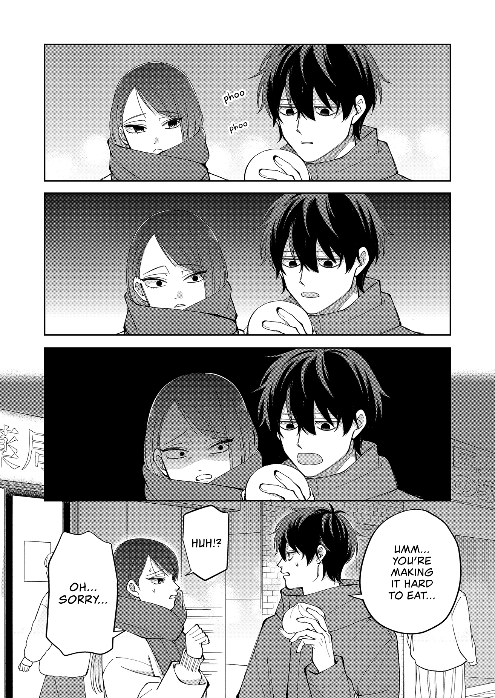

I’ve just caught up to a new ongoing manga, and I’m _so_ hooked that I need to talk about it. The series is called _Unexciting Date_ (Japanese: 盛りあがらないデート, Hepburn: _Moriagaranai Date_), but their dates are _anything_ but unexciting for readers. Imagine this: two gloomy, introverted adults, clumsily dating each other. Sounds like a snooze-fest, but throw in some manga hijinks, and you’ve got a tooth-achingly sweet and fresh rom-com series!

In short: it’s a deadpan, slow-burn rom-com about two awkward adults trying—sincerely, clumsily—to date.

:::figure

Japanese Volume 1 cover of _Unexciting Date_. Image: Suzuyuki via [X/Twitter](https://x.com/moriagaranai/status/1991416243866464628/)
:::

Here’s an [unofficial synopsis](https://anilist.co/manga/204291) to give you a feel for it.

> A So-So Match on a Dating App…
>
> Haida, cursed with chronic bad luck, signs up for a dating app as part of her “what-the-heck” phase. She matches with Kuroi, a man who joined for equally reckless reasons. But their conversation never quite clicks, and an unmistakably low-key, awkward mood sets in. Everything they do backfires, resulting in a date that is astonishingly unexciting.
>
> Thinking there’s no way there’ll be a second date in an atmosphere like this… wait, what? Why are they making plans to meet again!?
>
> A first date with someone you met on a dating app that just doesn’t take off? The deadpan, surreal banter is way too addictive! A slow-burning, gently unfolding romance that begins with a matching app.

Isn’t the synopsis interesting enough already???

Not sold yet? Fine. Let me gush about it some more.

## Why it works

For context: I’ve read a ton of rom-com manga. I’ve pretty much learned all the common tropes there are. Introverted boy × extroverted girl? Vice versa? Two geniuses? Two fools? Age gap? “Forbidden” romance? All the kinds of “[dere type](https://the-dere-types.fandom.com/wiki/Dere_Type)”? I’ve read them, including those for the male (shounen/seinen) and female (shoujo/josei) demographics.

But two dreary adults dating each other is exceedingly rare. It’s rare because the archetype is not a “main character” type, or is usually used as a cheap self-insert for the reader. And yet, _Unexciting Date_ manages to explore them in a way that’s funny, but still warm and grounded. Did I mention that both of them are functioning, working adults who are not hormonal trainwrecks you often see in teenage rom-coms? Yes, this is a [josei](https://tvtropes.org/pmwiki/pmwiki.php/Main/Josei) manga.

Both main characters tick every “socially inept” box. They are shy. They overthink. They are awkward around others. They don’t communicate well. Heck, one suffers from bad habits like smoking and gambling, and the other has comically bad luck. Sounds rough! But they are earnest. They are kind people. They want to grow their relationship with each other. They’re just… not built for it. These are two relatable people who are trying their best. And the author [Suzuyuki](https://x.com/suzuyuki_cookie) executed their characterization brilliantly. Both Haida and Kuroi have a consistent depiction throughout. Still, they slowly but surely come out of their shell to reach each other. Small victories feel genuinely earned rather than rushed by plot convenience. Like finally working up the courage to initiate physical contact, or learning to voice their feelings instead of spiraling into anxious overthinking. And as a reader—especially for the slice-of-life and slow-burn enjoyer—it’s fantastic. It’s lovely to see their small but measurable growth.

Anyway, I could keep yapping about the character writing. Let’s talk about the jokes.

## Comedy (and the chaos)

Comedy. Deadpan jokes. Unabashedly honest quips. Do you like absurd, dry humor? Do you like witty or outlandish delivery that leaves you dumbfounded and makes you laugh while thinking to yourself, “I just fucking died reading this”? Well, if that sounds like a good time for you—and, no shade, I know humor doesn’t work the same for everyone!—then there’s plenty of it. The author nails that mix of long, awkward silences and sudden brutality without holding back. One commenter remarked that the comedy feels like poorly-scripted game NPCs talking to each other candidly, and I agree.

The jokes aren’t just in the dialogue. Numerous dry gags are sprinkled throughout the panels. People doing outrageous things and acting like it’s just another Tuesday in the background? Check. A lot. They feel like the ~~absurd~~ easygoing townsfolk in _Sakamoto Days_. Weird people congregate around the main cast, such that it feels like they are the normal ones! Even though we know that they are also a hot mess!

:::figure

A lot of the humor is just… commitment to the bit. Like this scene where Haida silently stares for multiple panels while Kuroi tries to eat his steamed pork buns, getting more and more uncomfortable—over food she’s been hunting for all day. Image: Suzuyuki / Translation: OsisNie via [MangaDex](https://mangadex.org/chapter/6665a3e7-8b92-4298-bf4d-91880a4c3b1b/10)
:::

## The art is quietly great

On the art side, three things really stand out for me: expressions, outfits, and backgrounds.

The art of this series rules—especially the facial expressions. The cast look distinct and easily recognizable, with the main duo the most memorable. They have the signature “[resting bitch face](https://en.wikipedia.org/wiki/Resting_bitch_face),” which doesn’t help their case at all. People, especially the two, can easily misinterpret them. There are several jokes about this, where they overanalyze each other’s ambiguous reactions.

There is also the wonderful fact that the characters change clothes! If you’ve read a lot of manga, you’ll quickly notice the characters almost always wear the same attire. This is not the case here. The author draws various outfits, and they all look gorgeous (and comfy)! It’s a small detail that makes the world feel lived-in rather than like a static stage for rom-com beats to play out.

Another small thing I really appreciate: the backgrounds. Almost all the panels have neatly drawn backgrounds. Of course, there are panels without—often when they want to specifically frame the character and focus on something else. But when it isn’t framed that way, there’s almost always something in the background. To me, it’s a hallmark of well-drawn, unrushed manga—a trait I associate with series that aren’t being crushed by deadlines.[^1] Business is business, and there are too many circumstances to consider for me to generalize it this way. However, it’s my personal observation, and it suggests that the author takes pride in their work.

And on that point: this is a biweekly series, which might be part of why it feels so polished.

## Final thoughts

Overall, I really adore _Unexciting Date_. It’s a slow-burn romance that focuses on the characters. It’s about adults who are trying their best with their relationship. And so far, each chapter has left me with a warm, comfy feeling in my chest. It’s great.

I got the idea to write about this because chapter 27 left me with such a wonderful feeling that I need to “brain dump” my thoughts here. I literally screamed and kicked the air like a gleeful teenager reading that chapter, and I’d like to share the joy with others.

## Who it’s for

So, should you read it? Look, I’m clearly biased—but if you’re already a rom-com enjoyer, this will be a lovely discovery. It’ll be right up your alley, especially if you love slow-burn romances. And if you’re coming from the shounen side and you’re tired of loud escalation, this might feel refreshing. It’s best when you want an uncomplicated story that will make you feel good. I can’t promise it’ll work for everyone—humor is subjective, and the pacing is deliberately slow—but I’m glad I gave it a shot. At the very least, give it a try.

If you want to check it out, here are the official links:

- [Official Raw](https://ganma.jp/web/magazine/moriagaranai) on Ganma
- [Amazon JP](https://www.amazon.co.jp/dp/4046851546)
- [Book Walker](https://bookwalker.jp/series/547658)

And here’s the fan translation (which is how I read it):

- [Unofficial English Translation](https://mangadex.org/title/f4ad14b4-64d9-470f-9b4c-0fab84f0d507) on MangaDex

---

## The scanlation run

Okay, mini-detour—because the scanlation (fan translation) release experience was half the fun.

The series is unofficially translated by a favorite scanlator of mine, [u/OsisTheNie](https://www.reddit.com/user/OsisTheNie/), someone I’ve been following for the past two years, since the series they pick often align with my taste. Osis releases their translation daily on the [r/manga](https://www.reddit.com/r/manga/) subreddit until they’re caught up with the latest Japanese raw. Whenever they do, it’s a joy to open the subreddit. And, as a rom-com-pilled subreddit, I think a lot of people there agree. Osis’s posts almost always hit the front page and generate a ton of [discussion](https://www.reddit.com/r/manga/search/?q=flair%3Adisc+title%3A%22unexciting%20date%22&sort=new).[^2]

So, yeah, I’ve been really enjoying the daily release. I obsessively checked the subreddit for a new chapter, and I read most of the discussions. In a way, it’s kind of a sad goodbye because, now that we’re caught up, I’ll have to wait for a new chapter. The hype train has finally pulled into the station. But I’m grateful. It was an entertaining end to 2025 and the start of 2026.

As a side note, this is not the first time Osis has translated a great series like this. There were a few other hype runs that I’d love to discuss and gush about. Most of them are also an ongoing series, so when the mood strikes, I’ll definitely write one, even if it’s not as recent as this series.

[^1]: It’s worth remembering that the industry’s harsh working culture causes countless authors to burn out. The unhealthy overworking mindset has caused a significant number of authors to be sick, some for the rest of their lives. I personally advocate for a biweekly or monthly release schedule, making sure the author stays healthy.

[^2]: Posts with 50+ comments usually only happen for Weekly Shounen Jump series like _One Piece_ or Shounen Jump+ series like _Chainsaw Man_. You can count the series that are this popular, but not from those publications, with only your own two hands. Most of the popular posts are just fan-service arts or ‘thirst traps.’ It’s rare to see genuine discussion threads hit the top.
